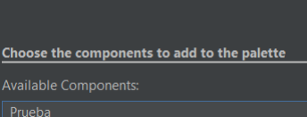

# Generador-de-comprobantes-en-formato-PDF

# Indice 
- [Autores](#Autores)
- [Explicación general](#Explicación-general)
- [Instrucciones de implementación ](#Instrucciones-de-implementación)
- [Instrucciones de uso](#Instrucciones-de-uso)
- [Explicación del código](#Explicación-del-código)
- [Video explicativo](#Video-explicativo)

# Autores
-- _Rodriguez Juarez Jose Daniel_

-- _Alonso Heredia Miguel Alberto_

# Explicación general
Componente visual que permite generar comprobantes de pago en formato PDF en base a los datos recaudados del usuario (Nombre completo, dirección, sucursal, nombre del local, productos, etc). El componente esta diseñado para ser utilizado en aplicaciones de registro de compras, proporcionando una forma sencilla de crear documentos PDF con los datos recaudados.


# Instrucciones de implementación 

## Implementar JFrame de prueba
## 1. Descargar el archivo zip. Una vez descargado el .zip deberan descomprimirlo.


## 2. Posteriormente deberemos buscarlo en la pc desde Netbeans, para eso seleccionamos el apartado "abrir proyecto".


## 3. Busca el proyecto y abrelo.
.png)

## 4. Una vez abierto les deberia de salir esto:


## Implementar componente a la paleta
### 1. Crear y Limpiar el proyecto.


### 2. Hacemos click derecho en la paleta y seleccionamos "palette manager".


### 3. Una vez dentro de este apartado selecciona "nueva categoria".


### 4. Te pedira darle un nombre a la categoria de tu paleta, asignale uno y dale ok.


### 5. Regresamos a la ventana anterior y seleccionamos Add from JAR.


### 6. En la carpeta del proyecto, para ser más precisos en la carpeta Dist debería aparecer el jar


### 7. Abrimos y debemos seleccionar “Prueba”.


### 8. Damos click en Next y elegimos en qué sección aparecerá el botón, nosotros creamos la sección llamada “Botón Comprobante”. Una vez seleccionado la sección finalizamos el proceso.


### 9. El botón ya deberia aparecer en la paleta.


# Instrucciones de uso
1.-Selecciona el componente desde la paleta.

2.-Arrastralo a la posicion en donde quieres colocarlo dentro de tu JFrame

5.-El JFrame aceptara cuadros de texto con los nombres de:


6.-Usted puede elegir qué producto va a vender desde el codigo


7.-El botón recolecta los datos que estén en el Cuadro de texto y listo para usarse 

## Propiedades configurables
- Cambiar el color del boton, el color de la letra del boton y el color del titulo del pdf


- Cambiar el titulo del PDF


- Cambiar el nombre de la tienda


# Métodos de la clase
## Constructor
```java
public BotonGenerarPDF() {
        configurarBoton();
        this.addActionListener(e -> generarPDF());
    }
```
## Metodos Setters y Getters
```java
   public BotonGenerarPDF() {
        configurarBoton();
        this.addActionListener(e -> generarPDF());
    }
    
    public String getTituloPDF() {
        return tituloPDF;
    }

    public void setTituloPDF(String tituloPDF) {
        this.tituloPDF = tituloPDF;
    }

    public String getNombreTienda() {
        return nombreTienda;
    }

    public void setNombreTienda(String nombreTienda) {
        this.nombreTienda = nombreTienda;
    }

    public Color getColorTitulo() {
        return colorTitulo;
    }

    public void setColorTitulo(Color colorTitulo) {
        this.colorTitulo = colorTitulo;
    }
        public Color getColorFondo() {
        return colorFondo;
    }

    public void setColorFondo(Color colorFondo) {
        this.colorFondo = colorFondo;
        this.setBackground(colorFondo); // Aplica el color inmediatamente
    }

    public Color getColorTexto() {
        return colorTexto;
    }

    public void setColorTexto(Color colorTexto) {
        this.colorTexto = colorTexto;
        this.setForeground(colorTexto); // Aplica el color inmediatamente
    }
```
Los métodos get y set permiten modificar o acceder a las propiedades privadas del botón, como:

- Título principal del PDF.
- Firma o nombre que aparece al final del documento.
- Color del título en el PDF.
- Color del fondo del botón.
- Color del texto del botón.

## Método configurarBoton()
```java
    private void configurarBoton() {
        this.setText("Generar PDF");
        this.setFont(new java.awt.Font("Arial", java.awt.Font.BOLD, 12));
        this.setBackground(colorFondo); // Usa la propiedad colorFondo
        this.setForeground(colorTexto); // Usa la propiedad colorTexto
        this.setFocusPainted(false);
    }
```
Configura el texto, fuente, color de fondo, color del texto y apariencia del botón.

## Método generarPDF()
```java
private void generarPDF() {
        try {
            JFrame frame = (JFrame) SwingUtilities.getWindowAncestor(this);
            JTextField txtNoPedido = buscarTextField(frame, "txtNoPedido");
            JTextField txtNombre = buscarTextField(frame, "txtNombre");
            JTextField txtPaterno = buscarTextField(frame, "txtPaterno");
            JTextField txtMaterno = buscarTextField(frame, "txtMaterno");
            JTextField txtTelefono = buscarTextField(frame, "txtTelefono");
            JTextField txtDireccion = buscarTextField(frame, "txtDireccion");
            JTextField txtPrecio = buscarTextField(frame, "txtPrecio");
            
            JComboBox<String> cmbProducto = null;
            for (Component comp : frame.getContentPane().getComponents()) {
                if (comp instanceof JComboBox && comp.getName() != null && comp.getName().equals("cmbProducto")) {
                    cmbProducto = (JComboBox<String>) comp;
                    break;
                }
            }
            
            if (txtNombre == null || txtPaterno == null || cmbProducto == null || txtNoPedido == null) {
                JOptionPane.showMessageDialog(frame, "Faltan campos esenciales para generar el PDF", "Error", JOptionPane.ERROR_MESSAGE);
                return;
            }

            Document document = new Document();
            String fileName = "Pedido_" + new SimpleDateFormat("yyyyMMdd_HHmmss").format(new Date()) + ".pdf";
            PdfWriter.getInstance(document, new FileOutputStream(fileName));
        
            document.open();
          
            // CONVERTIR Color de Swing a BaseColor de iText
            BaseColor pdfColor = new BaseColor(
            colorTitulo.getRed(), 
            colorTitulo.getGreen(), 
            colorTitulo.getBlue()
            );

            com.itextpdf.text.Font titleFont = new com.itextpdf.text.Font(
                com.itextpdf.text.Font.FontFamily.HELVETICA, 
                18, 
                com.itextpdf.text.Font.BOLD,
                pdfColor
            );

            com.itextpdf.text.Font normalFont = new com.itextpdf.text.Font(
                com.itextpdf.text.Font.FontFamily.HELVETICA, 
                12, 
                com.itextpdf.text.Font.NORMAL
            );

            com.itextpdf.text.Font boldFont = new com.itextpdf.text.Font(
                com.itextpdf.text.Font.FontFamily.HELVETICA, 
                12, 
                com.itextpdf.text.Font.BOLD
            );
            // Título del PDF (usando propiedad)
            Paragraph titulo = new Paragraph(this.tituloPDF, titleFont);
            titulo.setAlignment(Element.ALIGN_CENTER);
            titulo.setSpacingAfter(20);
            document.add(titulo);

            String nombreCompleto = txtNombre.getText() + " " + txtPaterno.getText() + 
                                   (txtMaterno != null ? " " + txtMaterno.getText() : "");
            
            Paragraph saludo = new Paragraph("Estimado(a) " + nombreCompleto + ":", boldFont);
            saludo.setSpacingAfter(10);
            document.add(saludo);

            String mensaje = "Muchas gracias por su compra de \"" + cmbProducto.getSelectedItem() + "\".\n\n" +
                            "Detalles de su pedido:\n" +
                            "- Número de pedido: " + txtNoPedido.getText() + "\n" +
                            (txtDireccion != null ? "- Dirección de envío: " + txtDireccion.getText() + "\n" : "") +
                            "- Producto: " + cmbProducto.getSelectedItem() + "\n" +
                            (txtPrecio != null ? "- Total a pagar: " + txtPrecio.getText() + "\n" : "") +
                            (txtTelefono != null ? "\nEn caso de cualquier duda, nos comunicaremos al: " + txtTelefono.getText() : "");

            Paragraph contenido = new Paragraph(mensaje, normalFont);
            contenido.setSpacingAfter(15);
            document.add(contenido);

            Paragraph despedida = new Paragraph(
            "\n¡Gracias por preferirnos!\n\n" +
            "Atentamente,\n" +
            this.nombreTienda + "\n" + // Aquí el cambio
            new SimpleDateFormat("dd/MM/yyyy").format(new Date()),
            new com.itextpdf.text.Font(
                com.itextpdf.text.Font.FontFamily.HELVETICA, 
                10, 
                com.itextpdf.text.Font.ITALIC
            ));
            despedida.setAlignment(Element.ALIGN_CENTER);
            document.add(despedida);

            document.close();
            
            JOptionPane.showMessageDialog(frame, 
                "Comprobante generado exitosamente:\n" + fileName, 
                "PDF Generado", 
                JOptionPane.INFORMATION_MESSAGE);

        } catch (Exception ex) {
            JOptionPane.showMessageDialog(null, 
                "Error al generar PDF: " + ex.getMessage(), 
                "Error", 
                JOptionPane.ERROR_MESSAGE);
            ex.printStackTrace();
        }
    }

    private JTextField buscarTextField(Container container, String nombre) {
        for (Component comp : container.getComponents()) {
            if (comp instanceof JTextField && comp.getName() != null && comp.getName().equals(nombre)) {
                return (JTextField) comp;
            } else if (comp instanceof Container) {
                JTextField encontrado = buscarTextField((Container) comp, nombre);
                if (encontrado != null) return encontrado;
            }
        }
        return null;
    }
```
Método principal que genera el archivo PDF con los datos del formulario en la interfaz gráfica.

# Video explicativo
https://youtu.be/K6PsaPKJoDU?si=4Porj4kNKb9tt_M- 
